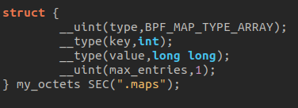
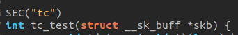
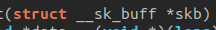

# How to write eBPF program

This guide broadly explains how to create an eBPF program intended to be executed within the kernel. Given that eBPF technology is rapidly evolving and tools such as libbpf or bpftool are constantly being updated, this document may quickly become outdated

## Library 

Various libraries can be used within eBPF programs, including:

- bpf/bpf_helpers.h: provides the definitions of BPF helper functions.

- bpf/bpf_tracing.h: contains definitions for macros, helper functions, and data structures necessary for creating eBPF programs that focus on tracing system calls, kernel functions, and other events within the kernel.

- bpf/bpf_core_read.h: offers macros and helper functions to facilitate the secure reading of data from kernel space to a BPF program without triggering access violations.

- linux/bpf.h: provides basic definitions, constants, data structures, and function prototypes necessary for developing and interacting with BPF programs in the kernel space.

The use of the vmlinux.h file, which is an automatically generated header file containing definitions of data structures, symbols, and function prototypes extracted directly from the compiled Linux kernel, is highly recommended. if you want to use it, dont forget to add this command to your makefile  :

    bpftool btf dump file /sys/kernel/btf/vmlinux format c > vmlinux.h
 

At a minimum, you must include linux/bpf.h or vmlinux.h for your program to work.

##  Maps

Generally, maps are declared as follows:

- type: the type of the map
- key: the index type used to access elements
- value: the type of elements stored in the map
- max_entries: the maximum number of elements that can be stored.

A name is also associated with the map (here, "my_octets") and it is stored in the ELF ".maps" section (which will be used by libbpf to access the map from the user-space program).

The type of map greatly influences how eBPF maps are declared. Therefore, I invite you to consult the following page for more detailed explanations on the different types of maps and how to use them : https://www.kernel.org/doc/html/latest/bpf/maps.html

##  Program type

The behavior of an eBPF program, as well as the helper functions that the eBPF program can access, are determined by the program type. Therefore, it is important to understand how this works.

The type of eBPF programs is mostly specified just above the program's main function ( with SEC() ). The program is then associated with the ELF section bearing this name. This defines where the program can be attached and what type of data it will be able to act upon.

It's possible to specify the type of attachment ( event ) you want for our program depending on its type. The formats vary significantly depending on the program type. I invite you to consult the following page to get the complete list: https://www.kernel.org/doc/html/latest/bpf/libbpf/program_types.html#program-types-and-elf.

The program type and the event also determines the type of "context" (the function parameters) that the main function receives (see the "Functions" section).

##  Functions and context

Functions are the core of eBPF programs as they contain all the code that will be executed when the event associated with the program is captured. Each program has a context, which depends on the program type and the event it is associated with. The context contains information about the captured event and is passed as a parameter to the main function. 

Once again, the list of possible context types varies widely, and there is no site that lists them all. They are defined in different parts of the kernel headers. However, you can get an idea by visiting the following site: https://blogs.oracle.com/linux/post/bpf-a-tour-of-program-types

You can also create functions ,structures and types ,as in any other program, which will be used in the main function. However, you have to assert that every potential error in any part of the ebpf program is handle. If its not the case, the eBPF verifier will not allow the code to run on the kernel. 

Don't forget to add the licence of your program like this:

    char LICENSE[] SEC("license") = "Dual BSD/GPL";

otherwise, the code will not work.

## Compilation

You can use Clang or GCC to do it. For example: 

    clang -target bpf -D __TARGET_ARCH_(your ARCH name) -Wall -O2 -g -c prog_name.c -o prog_name.o

- -target is used to specified the type of program we try to compile. 
- -D__TARGET_ARCH_(your ARCH name) is necessary if you use libraries such as bpf/bpf_tracing.h, because they contain types and structures based on elements specific to the system architecture, like registers, for example.

## Manipulate the program

In this example, we use the tool bpftool.

First, we load the program into the kernel

    sudo bpftool prog load prog_name.o /sys/fs/bpf/prog_name

then we retrieve its ID: 

    sudo bpftool prog list

and finally, we attach the program using its previously retrieved ID:

    sudo bpftool prog attach id 

to detach the program and remove it from the kernel:

    sudo bpftool net detach id

then

    sudo rm /sys/fs/bpf/prog_name

To verify that the program is no longer in the kernel:

    sudo bpftool prog show name prog_name

The whole set of these operations is quite tedious. It is possible to do otherwise by using a specific user space program to attach, detach, load, and remove the program using libbpf macros.

I invite you to read the following documentations to learn about the libbpf macros and understand the concept of "skeleton" :

- https://libbpf.readthedocs.io/en/latest/api.html 

- https://www.kernel.org/doc/html/latest/bpf/libbpf/libbpf_overview.html

