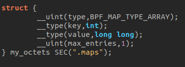

# How to write eBPF program

this guide is about how to write a ebpf program properly. 

## Kernel Space program

### Library 

/*TODO*/

### Maps

De manière générale les maps se déclarent comme ceci :

- type: the type of the map
- key: the index type used to access elements
- value: the type of elements stored in the map
- max_entries: the maximum number of elements that can be stored.

A name is also associated with the map (here, "my_octets") and it is stored in the ELF ".maps" section (which will be used by libbpf to access the map from the user-space program).

The type of map greatly influences how eBPF maps are declared. Therefore, I invite you to consult the following page for more detailed explanations on the different types of maps and how to use them : https://www.kernel.org/doc/html/latest/bpf/maps.html

### Program type

The behavior of an eBPF program, as well as the helper functions that the eBPF program can access, are determined by the program type. Therefore, it is important to understand how this works.

The type of eBPF programs is mostly specified just above the program's main function. The program is then associated with the ELF section bearing this name. This defines where the program can be attached and what type of data it will be able to act upon.

It's possible to specify the type of attachment you want for our program depending on its type. The formats vary significantly depending on the program type. I invite you to consult the following page to get the complete list: https://www.kernel.org/doc/html/latest/bpf/libbpf/program_types.html#program-types-and-elf.

The program type also determines the type of "context" (the function parameters) that the program receives (see the "Functions" section).

### Functions

/*TODO*/

